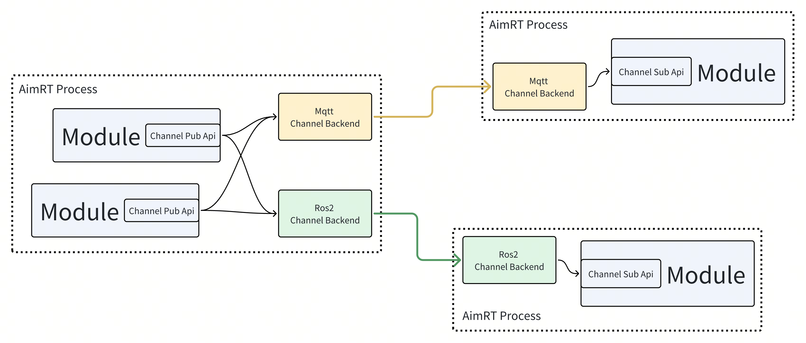
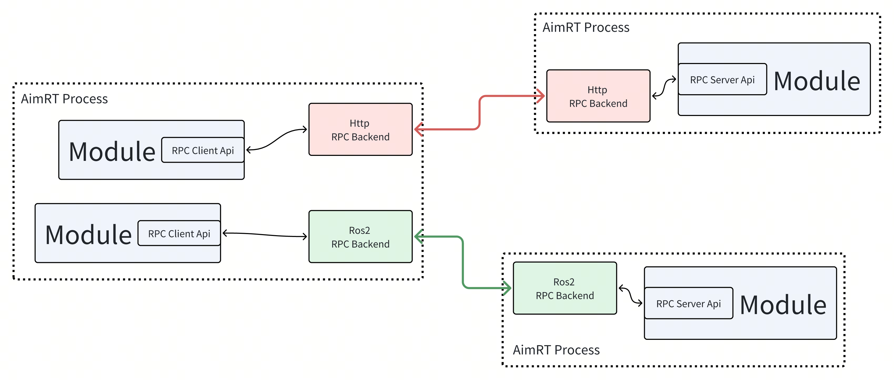
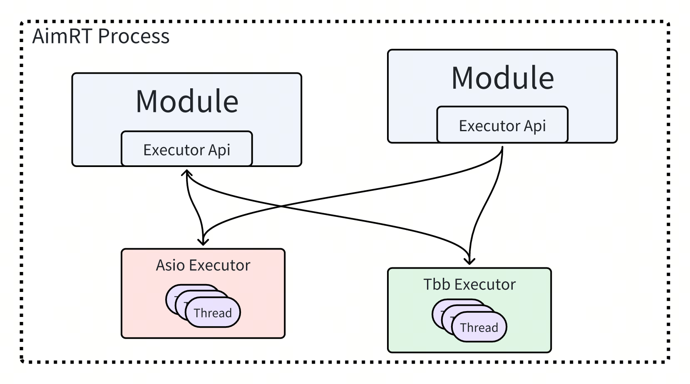
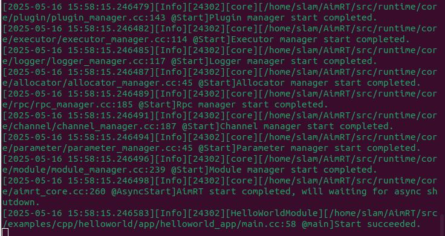

# AimRT入门教程

## 源码架构

本人的系统是Ubuntu 22.04，在此基础上对AimRT进行源码编译  
注意：AimRT 编译所需的最小 CMake 版本为 3.24，Ubuntu 22.04 使用 apt 包管理器安装的 CMake 版本为 3.22 不符合要求  
可以使用命令行 cmake --version查看当前版本，比如我的版本为：cmake version 4.0.1  
下载源码git clone https://github.com/AimRT/AimRT.git  
参考 AimRT 源码中的 src 目录，AimRT 框架中包含的内容如下：
```bash
src
├── common --------------------------------- // 一些基础的、可以直接使用的通用组件，例如 string、log 接口、buffer 等
├── examples ------------------------------- // AimRT 官方示例
│   ├── cpp -------------------------------- // CPP 接口的示例
│   ├── py --------------------------------- // Python 接口的示例
│   └── plugins ---------------------------- // 插件的使用示例
├── interface ------------------------------ // AimRT 接口层
│   ├── aimrt_core_plugin_interface -------- // [CPP] 插件开发接口
│   ├── aimrt_module_c_interface ----------- // [C] 模块开发接口
│   ├── aimrt_module_cpp_interface --------- // [CPP] 模块开发接口，对 C 版本的封装
│   ├── aimrt_module_protobuf_interface ---- // [CPP] 与 protobuf 相关的模块开发接口，基于 CPP 版本接口
│   ├── aimrt_module_ros2_interface -------- // [CPP] 与 ROS2 相关的模块开发接口，基于 CPP 版本接口
│   ├── aimrt_pkg_c_interface -------------- // [C] Pkg 开发接口
│   └── aimrt_type_support_pkg_c_interface - // [C] Type support 包接口
├── plugins -------------------------------- // AimRT 官方插件
├── protocols ------------------------------ // AimRT 官方标准协议
├── runtime -------------------------------- // AimRT 运行时
│   ├── core ------------------------------- // 运行时核心库
│   ├── main ------------------------------- // 基于 core 实现的一个主进程"aimrt_main"
│   └── python_runtime --------------------- // 基于 pybind11 封装的 python 版本运行时
└── tools ---------------------------------- // 一些配套工具
```
## AimRt中的概念
1. AimRT 拥有一个用于标识独立逻辑单元的概念：Module。Module是一个逻辑层面的概念，代表一个逻辑上内聚的块。Module之间可以在逻辑层通过Channel和RPC两种抽象的接口通信。可以通过实现几个简单的接口来创建一个Module。一个Module通常对应一个硬件抽象、或者是一个独立算法、一项业务功能。Module可以使用框架提供的句柄来调用各项运行时功能，例如配置、日志、执行器等。框架给每个Module提供的句柄也是独立的，来实现一些资源统计、管理方面的功能。
2. Node代表一个可以部署启动的进程，在其中运行了一个 AimRT 框架的 Runtime 实例。Node是一个部署、运行层面的概念，一个Node中可能存在多个Module。Node在启动时可以通过配置文件来设置日志、插件、执行器等运行参数。
3. Pkg是 AimRT 框架运行Module的一种途径。Pkg代表一个包含了单个或多个Module的动态库，Node在运行时可以加载一个或多个Pkg。可以通过实现几个简单的模块描述接口来创建Pkg。Module的概念更侧重于代码逻辑层面，而Pkg则是一个部署层面的概念，其中不包含业务逻辑代码。一般来说，在可以兼容的情况下，推荐将多个Module编译在一个Pkg中，这种情况下使用 RPC、Channel 等功能时性能会有优化。通常Pkg中的符号都是默认隐藏的，只暴露有限的纯 C 接口，不同Pkg之间不会有符号上的相互干扰。不同Pkg理论上可以使用不同版本的编译器独立编译，不同Pkg里的Module也可以使用相互冲突的第三方依赖，最终编译出的Pkg可以二进制发布。
4. AimRT 中的 “Protocol” ，Protocol意为协议，代表Module之间通信的数据格式，用来描述数据的字段信息以及序列化、反序列化方式，例如Channel的订阅者和发布者之间制定的数据格式、或者RPC客户端和服务端之间制定的请求包/回包的数据格式。通常由一种IDL( Interface description language )描述，然后由某种工具转换为各个语言的代码。
AimRT 目前官方支持两种 IDL：
    - Protobuf
    - ROS2 msg/srv

    但AimRT 并不限定协议与IDL的具体类型，使用者可以实现其他的 IDL，例如 Thrift IDL、FlatBuffers 等，甚至支持一些自定义的 IDL。
5. AimRT 中的 “Channel” 概念，Channel也叫数据通道，是一种典型的通信拓扑概念，其通过Topic标识单个数据通道，由发布者Publisher和订阅者Subscriber组成，订阅者可以获取到发布者发布的数据。Channel是一种多对多的拓补结构，Module可以向任意数量的Topic发布数据，同时可以订阅任意数量的Topic。类似的概念如 ROS 中的 Topic、Kafka/RabbitMQ 等消息队列。在 AimRT 中，Channel 由接口层和后端两部分组成，两者相互解耦。接口层定义了一层抽象的 Api，表示逻辑层面上的Channel；而后端负责实际的 Channel 数据传输，可以有多种类型。AimRT 官方提供了一些 Channel 后端，例如 mqtt、ros2 等，使用者也可以自行开发新的 Channel 后端。开发者在使用 AimRT 中的 Channel 功能时，先在业务逻辑层调用接口层的 API，往某个 Topic 中发布数据，或订阅某个 Topic 的数据。然后 AimRT 框架会根据一定的规则，选择一个或几个 Channel 后端进行处理，这些后端将数据通过一些特定的方式发送给其他节点，由其他节点上对应的 Channel 后端接收数据并传递给业务逻辑层。整个逻辑流程如下图所示：
  

6. AimRT 中的 “Rpc” 概念，RPC也叫远程过程调用，基于请求-回复模型，由客户端Client和服务端Server组成，Module可以创建客户端句柄，发起特定的 RPC 请求，由其指定的、或由框架根据一定规则指定的服务端来接收请求并回复。Module也可以创建服务端句柄，提供特定的 RPC 服务，接收处理系统路由过来的请求并回复。类似的概念如 ROS 中的 Services、GRPC/Thrift 等 RPC 框架。在 AimRT 中，RPC 也由接口层和后端两部分组成，两者相互解耦。接口层定义了 RPC 的抽象 Api，而后端则负责实际的 RPC 调用。AimRT 官方提供了一些 RPC 后端，例如 http、ros2 等，使用者也可以自行开发新的 RPC 后端。开发者使用 AimRT 的 RPC 功能时，先在业务逻辑层调用接口层 API，通过 Client 发起一个 RPC 调用，AimRT 框架会根据一定的规则选择一个 RPC 后端进行处理，它将数据通过一些特定的方式发送给 Server 节点，由 Server 节点上对应的 Rpc 后端接收数据并传递给业务层，并将业务层的回包传递回 Client 端。整个逻辑流程如下图所示：


7. AimRT 中的 “Executor” 概念，Executor，或者叫执行器，是指一个可以运行任务的抽象概念，一个执行器可以是一个 Fiber、Thread 或者 Thread Pool，我们平常写的代码也是默认的直接指定了一个执行器：Main 线程。一般来说，能提供以下接口的就可以算是一个执行器：
```bash
void Execute(std::function<void()>&& task);
```
还有一种Executor提供定时执行的功能，可以指定在某个时间点或某段时间之后再执行任务。其接口类似如下：
```bash
void ExecuteAt(std::chrono::system_clock::time_point tp, std::function<void()>&& task);
void ExecuteAfter(std::chrono::nanoseconds dt, std::function<void()>&& task);
```
在 AimRT 中，执行器功能由接口层和实际执行器的实现两部分组成，两者相互解耦。接口层定义了执行器的抽象 Api，提供投递任务的接口。而实现层则负责实际的任务执行，根据实现类型的不同有不一样的表现。AimRT 官方提供了几种执行器，例如基于 Asio 的线程池、基于 Tbb 的无锁线程池、基于时间轮的定时执行器等。

开发者使用 AimRT 的执行器功能时，在业务层将任务打包成一个闭包，然后调用接口层的 API，将任务投递到具体的执行器内，而执行器会根据自己的调度策略，在一定时机执行投递过来的任务。具体逻辑流程如下图所示：


8. AimRT 中的 “Plugin” 概念，Plugin指插件，是指一个可以向 AimRT 框架注册各种自定义功能的动态库，可以被框架运行时加载，或在用户自定义的可执行程序中通过硬编码的方式注册到框架中。AimRT 框架暴露了大量插接点和查询接口，例如：
     - 日志后端注册接口  
     - Channel/Rpc 后端注册接口
     - Channel/Rpc 注册表查询接口
     - 各组件启动 hook 点
     - RPC/Channel 调用过滤器
     - 模块信息查询接口
     - 执行器注册接口
     - 执行器查询接口
     - …

使用者可以直接使用一些 AimRT 官方提供的插件，也可以从第三方开发者处寻求一些插件，或者自行实现一些插件以增强框架的服务能力，满足特定需求。

9. AimRT 中的协议，协议在 AimRT 中的主要作用是实现组件之间的数据交换和通信。无论是在同一进程内还是跨进程通信，AimRT都提供了一个统一的接口和数据序列化/反序列化机制，确保数据能够正确传输和解析。AimRT 现支持 ros2 和 protobuf 两种协议：
参考 AimRT 源码中的 src/protococols 目录
```bash
src/protocols
├── pb
│   ├── actuator
│   ├── common
│   ├── example
│   ├── geometry
│   └── sensor
├── plugins
│   ├── log_control_plugin
│   ├── parameter_plugin
│   ├── record_playback_plugin
│   ├── ros2_plugin_proto
│   ├── time_manipulator_plugin
│   └── topic_logger_plugin
└── ros2
    ├── aimrt_msgs
    ├── example_ros2
    └── ros2_msgs
```


## AimRT 接口概述
AimRT 为多种开发、应用场景提供了界面，总体来说包括以下方面：
- 模块逻辑开发接口：用于开发具体的业务模块，包含 C、CPP、Python 接口，其中 CPP 接口是基于 C 接口封装的，Python 接口是基于 CPP 接口封装的；
- 实例部署运行接口：主要用于 APP 模式下部署运行，包含 CPP、Python 接口，其中Python 接口是基于 CPP 接口封装的；
- 实例运行配置：AimRT 运行时配置，Yaml 形式；
- 插件开发接口：用于开发 AimRT 插件，仅提供 CPP 接口；

在 AimRT 中，一个重要是思想是将逻辑实现与实际部署运行分离。用户在开发业务逻辑时不需要关心最后部署运行的方式，在最终部署运行时发生的一些变化也不需要修改业务逻辑代码。
AimRT 框架在运行时依次有三大阶段：Initialize、Start、Shutdown。这三个阶段的意义以及对应阶段做的事情如下：
- Initialize阶段：
    - 初始化 AimRT 框架；
    - 初步初始化业务，申请好业务所需的 AimRT 框架中的资源；
    - 在主线程中依次完成所有的初始化，不会开业务线程，所有代码是线程安全的；
    - 部分接口或资源不能在此阶段使用，只能等到Start阶段使用；

- Start阶段：
    - 完全初始化业务；
    - 启动业务相关逻辑；
    - 可以开始使用 AimRT 中的所有资源，如发起 RPC、将任务投递到线程池等；
    - 在主线程中依次启动各个业务，业务可以再调度到多线程环境中；
    - 部分接口只能在Initialize阶段调用，不能在此阶段调用；

- Shutdown阶段：
    - 通常由 ctrl-c 等信号触发；
    - 优雅停止业务；
    - 优雅停止 AimRT 框架；
    - 在主线程中阻塞的等待所有业务逻辑结束；
    - 大部分接口在此阶段都无法继续使用；

简而言之，一些申请 AimRT 资源的操作，只能在 Initialize 阶段去做，以此来保证在业务运行期间AimRT框架不会有新的资源申请或者锁操作，保证 Start 阶段的效率和稳定性。

## AimRT 框架集成业务逻辑的两种方式
AimRT 框架可以通过两种方式来集成业务逻辑，分别是 App模式 和 Pkg模式，实际采用哪种方式需要根据具体场景进行判断。两者的区别如下：
1. App模式：在开发者自己的 Main 函数中直接链接 AimRT 运行时库，编译时直接将业务逻辑代码编译进主程序：
- 优势：没有 dlopen 这个步骤，没有 so，只会有最终一个 exe。
- 劣势：可能会有第三方库的冲突；无法独立的发布Module，想要二进制发布只能直接发布 exe。
- 使用场景：一般用于小工具、小型 Demo 场景，没有太大的模块解耦需求；

2. Pkg模式：使用 AimRT 提供的 aimrt_main 可执行程序，在运行时根据配置文件加载动态库形式的Pkg，导入其中的Module类:
- 优势：编译业务Module时只需要链接非常轻量的 AimRT 接口层，不需要链接 AimRT 运行时库，减少潜在的依赖冲突问题；可以二进制发布 so；独立性较好。
- 劣势：框架基于 dlopen 加载Pkg，极少数场景下会有一些兼容性问题。
- 使用场景：一般用于中大型项目，对模块解耦、二进制发布等有较强烈需求时；

无论采用哪种方式都不影响业务逻辑，且两种方式可以共存，实际采用哪种方式需要根据具体场景进行判断。注意，上述说的两种方式只是针对 Cpp 开发接口。如果是使用 Python 开发，则只支持App模式。


## 源码编译
在源码下有build.sh文件用来我门直接编译。首先我们看一下这个cmake选项有哪些

```bash
cmake -B build \  # 指定构建目录为 build，生成的构建文件会放在该目录下
    -DCMAKE_BUILD_TYPE=Release \  # 设置构建类型为 Release（优化编译，去掉调试信息）
    -DAIMRT_INSTALL=ON \  # 启用安装功能，允许执行 `make install`
    -DCMAKE_INSTALL_PREFIX=./build/install \  # 指定安装目录为 ./build/install
    -DAIMRT_BUILD_TESTS=OFF \  # 不编译测试代码
    -DAIMRT_BUILD_EXAMPLES=ON \  # 编译示例程序
    -DAIMRT_BUILD_DOCUMENT=ON \  # 构建文档
    -DAIMRT_BUILD_PROTOCOLS=ON \  # 构建通信协议相关模块
    -DAIMRT_BUILD_RUNTIME=ON \  # 构建运行时相关组件
    -DAIMRT_BUILD_CLI_TOOLS=ON \  # 构建命令行工具
    -DAIMRT_BUILD_PYTHON_RUNTIME=ON \  # 构建 Python 运行时支持
    -DAIMRT_USE_FMT_LIB=ON \  # 启用 fmt 格式化库（用于字符串格式化）
    -DAIMRT_BUILD_WITH_PROTOBUF=ON \  # 启用 protobuf 支持，用于序列化通信协议
    -DAIMRT_USE_LOCAL_PROTOC_COMPILER=OFF \  # 不使用本地 protoc 编译器，可能使用系统默认或下载的版本
    -DAIMRT_USE_PROTOC_PYTHON_PLUGIN=OFF \  # 不使用 Python 的 protobuf 插件
    -DAIMRT_BUILD_WITH_ROS2=ON \  # 启用 ROS2 支持，集成 ROS2 功能
    -DAIMRT_BUILD_NET_PLUGIN=ON \  # 构建网络通信插件
    -DAIMRT_BUILD_MQTT_PLUGIN=ON \  # 构建 MQTT 通信插件
    -DAIMRT_BUILD_ZENOH_PLUGIN=ON \  # 构建 Zenoh 通信插件
    -DAIMRT_BUILD_ICEORYX_PLUGIN=ON \  # 构建 Iceoryx 插件（用于高性能进程间通信）
    -DAIMRT_BUILD_ROS2_PLUGIN=ON \  # 构建 ROS2 插件
    -DAIMRT_BUILD_RECORD_PLAYBACK_PLUGIN=ON \  # 构建数据记录与回放插件
    -DAIMRT_BUILD_TIME_MANIPULATOR_PLUGIN=ON \  # 构建时间控制插件（如时间加速、回放等）
    -DAIMRT_BUILD_PARAMETER_PLUGIN=ON \  # 构建参数管理插件
    -DAIMRT_BUILD_LOG_CONTROL_PLUGIN=ON \  # 构建日志控制插件
    -DAIMRT_BUILD_TOPIC_LOGGER_PLUGIN=ON \  # 构建主题日志记录插件（记录通信消息）
    -DAIMRT_BUILD_OPENTELEMETRY_PLUGIN=ON \  # 构建 OpenTelemetry 插件，用于分布式追踪和监控
    -DAIMRT_BUILD_GRPC_PLUGIN=ON \  # 构建 gRPC 插件，用于远程过程调用
    -DAIMRT_BUILD_ECHO_PLUGIN=ON \  # 构建 echo 插件（用于消息回显调试）
    -DAIMRT_BUILD_PROXY_PLUGIN=ON \  # 构建代理插件（用于通信代理、转发等）
    -DAIMRT_BUILD_PYTHON_PACKAGE=ON \  # 构建 Python 包（便于通过 pip 安装或使用）
     -DCMAKE_POLICY_VERSION_MINIMUM=3.5 \

```


此时我们可以直接运行编译脚本

```bash
./build.sh 
```
编译完成之后可以看见aimrt依赖的第三方库都存放在_deps文件夹下


## 运行一个HelloWorld

一个最基本的 cpp helloworld 示例，演示内容包括：
- 如何继承 ModuleBase 创建一个模块；
- 如何以 Pkg 模式启动；
- 如何使用 Configurator 功能；
- 如何使用 Log 功能；


核心代码：
- [helloworld_module.cc]

```bash
#include "helloworld_module/helloworld_module.h"
#include "yaml-cpp/yaml.h"

namespace aimrt::examples::cpp::helloworld::helloworld_module {

bool HelloWorldModule::Initialize(aimrt::CoreRef core) {
  // Save aimrt framework handle
  core_ = core;

  // Read cfg
  auto file_path = core_.GetConfigurator().GetConfigFilePath();
  if (!file_path.empty()) {
    YAML::Node cfg_node = YAML::LoadFile(std::string(file_path));
    for (const auto& itr : cfg_node) {
      std::string k = itr.first.as<std::string>();
      std::string v = itr.second.as<std::string>();
      AIMRT_INFO("cfg [{} : {}]", k, v);
    }
  }

  AIMRT_INFO("Init succeeded.");

  return true;
}

bool HelloWorldModule::Start() {
  AIMRT_INFO("Start succeeded.");

  return true;
}

void HelloWorldModule::Shutdown() {
  AIMRT_INFO("Shutdown succeeded.");
}

}  // namespace aimrt::examples::cpp::helloworld::helloworld_module
```

- [pkg_main.cc]

```bash
#include "aimrt_pkg_c_interface/pkg_macro.h"
#include "helloworld_module/helloworld_module.h"

static std::tuple<std::string_view, std::function<aimrt::ModuleBase*()>> aimrt_module_register_array[]{
    {"HelloWorldModule", []() -> aimrt::ModuleBase* {
       return new aimrt::examples::cpp::helloworld::helloworld_module::HelloWorldModule();
     }}};

AIMRT_PKG_MAIN(aimrt_module_register_array)
```


配置文件：
- [examples_cpp_helloworld_cfg.yaml]
```bash
aimrt:
  log:
    core_lvl: INFO # Trace/Debug/Info/Warn/Error/Fatal/Off
    backends:
      - type: console
  module:
    modules:
      - name: HelloWorldModule
        log_lvl: INFO

# Module custom configuration
HelloWorldModule:
  key1: val1
  key2: val2
```


运行方式（linux）：
编译完成后，将生成的可执行文件helloworld_app和配置文件helloworld_cfg.yaml拷贝到一个目录下，然后执行以下命令运行进程，观察打印出来的日志：

./helloworld_app ./helloworld_cfg.yaml



## 个人感受
AIMRT 更像是一个 应用集成型中间件框架，而不是一个传统意义上的“通用开发库”。
它的设计理念更偏向于：
- 提供一整套运行环境；
- 支持通信中间件（MQTT、ROS2、GRPC、Iceoryx等）；
- 具备分布式部署能力；
- 插件式扩展；
- 支持 Python、C++、CLI、多种插件机制；
- 包含数据记录、时间操控、遥测、调试工具等。

换句话说，它更像是“给开发工业或机器人系统的人一个现成的基础平台”，而不是提供一个类似 Boost 或 Eigen 那样的轻量 C++ 库。

## 为什么编写一个 AIMRT 的 helloworld 很困难？

- 模块之间强耦合，如 topic/logger、runtime/init、plugin 等；
- 缺乏“可剥离结构”，一个功能可能依赖多个插件；
- 没有提供足够独立的 target_link_libraries() 方式（不像 Boost、PCL、gRPC 那样可以局部链接）


## 我的点评

1. 依赖性  
优点：支持多种后端通信协议、Python绑定、日志系统、遥测、记录回放等  
缺点：构建过程重，依赖较多，构建时需要处理大量外部库（如 ROS2、Protobuf、gRPC、Zenoh、fmt、Python 等）  

2. 结构复杂度  
优点：插件化结构设计良好，模块清晰  
缺点：入门门槛高、模块初始化流程复杂，很多功能需要环境变量或配置文件支持，难以直接“裸跑一个模块”  

3. 文档/示例友好度  
优点：有例子，有一定文档  
缺点：缺乏“从0开始的最小可运行样例”，例如 helloworld.cpp + CMakeLists.txt 的组合不容易跑通；大量组件相互依赖，导致编译/运行不透明  

4. 构建/打包方式  
优点：CMake 配置齐全、支持安装、可嵌入较大工程  
缺点：安装体积大，很多插件你不需要也被默认开启；CMake 参数繁多，新用户难以筛选精简配置；无法作为单个 .so 被快速集成  

5. 使用模式分析  
适合：中大型系统开发、机器人中间件、工业运行平台  
不适合：想写一个简单 hello world、仅想使用某个通信库或组件的用户  

它表面上是一个可复用的开源库，但实质上：它更像一个“框架+平台+组件集合”的中间件运行平台，不是面向开发者的纯粹开发库。这就是为何想写一个最简单的 “hello world”，却发现异常困难的原因。


## 总结

|维度	|评价|
| ------------- | -------------- | 
|依赖	|重依赖，需大量外部库|
|架构	|插件化强、模块多，但复杂|
|易用性	|入门门槛高，难以轻量上手|
|定位	|运行中间件平台,通用可调用的第三方开发库|
|适合场景	|中大型工业/机器人系统、需要插件运行平台的场景|
|不适合场景	|学习通信、简单模块、helloworld 类快速验证|


