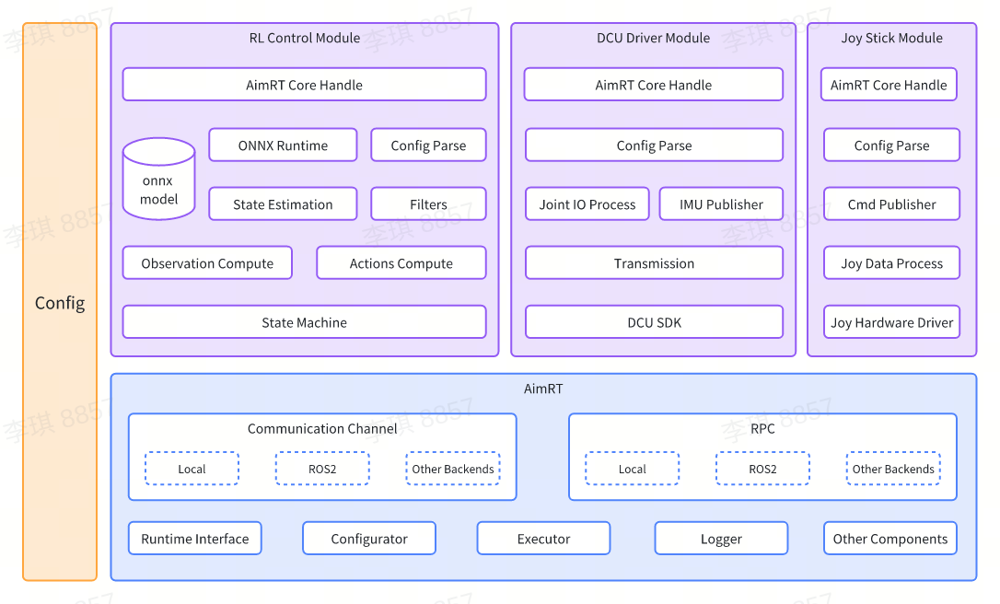

# Readme

English | [中文](README.zh_CN.md)

## Introduction

[AgiBot X1](https://www.zhiyuan-robot.com/qzproduct/169.html) is a modular humanoid robot with high dof developed and open-sourced by AgiBot. It is built upon AgiBot's open-source framework AimRT as middleware and using reinforcement learning for locomotion control.

This project is about the accompanying software for AgiBot X1, including multiple functional modules such as model inference, platform driver, and software simulation.

For detailed tutorials on `AimRT` framework, please visit the [AimRT official website](https://aimrt.org/).


## Software Architecture Diagram



For detailed annotations of modules, please refer to the [Development Guide](doc/tutorials.md).

## Directory Structure

```bash
.
├── build.sh              # Build scripts
├── cmake                 # CMake scripts for build dependencies
│   ├── GetAimRT.cmake
│   ├── GetGTest.cmake
│   └── NamespaceTool.cmake
├── CMakeLists.txt        # Top-level CMakeLists.txt
├── format.sh             # Formatting scripts
├── README.md             # README document
├── doc                   # Development guide directory
├── src                   # Source code directory
│   ├── CMakeLists.txt    # CMakeLists.txt for the source code directory
│   ├── assistant         # ROS2 simulation and example project directory
│   ├── install           # Configuration script directory
│   ├── module            # Module directory
│   ├── pkg               # Deployment directory
│   └── protocols         # Protocol directory
└── test.sh               # Testing scripts
```

## Running Instructions

### Preparation for Launch

- Install [GCC-13](https://www.gnu.org/software/gcc/gcc-13/).

- Install [cmake](https://cmake.org/download/) (version 3.26 or above).

- Install [ONNX Runtime](https://github.com/microsoft/onnxruntime).

```bash
sudo apt update
sudo apt install -y build-essential cmake git libprotobuf-dev protobuf-compiler

git clone --recursive https://github.com/microsoft/onnxruntime

cd onnxruntime
./build.sh --config Release --build_shared_lib --parallel

cd build/Linux/Release/
sudo make install
```

- Install `ROS2 Humble` and configure the environment variables. For detailed instructions, visit the [ROS2 official website](https://docs.ros.org/en/humble/Installation/Ubuntu-Install-Debians.html).

- Install dependencies for the simulation environment.

```bash
sudo apt install jstest-gtk libglfw3-dev libdart-external-lodepng-dev
```

- Install the Linux [realtime kernel patch](https://wiki.linuxfoundation.org/realtime/start) if real-robot debugging is needed.

*It will be very slow or even fail to download AimRT's numerous dependencies from default sources. Therefore, we provide environment variables `DOWNLOAD_FLAGS` for the download based on the Gitee source in `url_gitee.bashrc`. Simply source `url_gitee.bashrc` before running `build.sh` and add environment variable parameters for the Gitee source.*

After completing the above steps, execute the following commands in the terminal:

```bash
source /opt/ros/humble/setup.bash
source url_gitee.bashrc

# Build
./build.sh $DOWNLOAD_FLAGS

# Test
./test.sh $DOWNLOAD_FLAGS
```

### Launch Simulation

Before starting, it is necessary to connect the handle receiver.

```bash
cd build/
./run_sim.sh
```

### Launch on Real Robot

Export your library path first, **just need to execute once**.

```bash
# Open "/etc/ld.so.conf" as root
sudo vi /etc/ld.so.conf

# Add this path to the end of "/etc/ld.so.conf"
/opt/ros/humble/lib
{YourProjectSource}/build/install/lib

# Refresh system env
sudo ldconfig
```

Ready to launch.

```bash
cd build/
./run.sh
```

### Joystick Control

For specific control instructions, please refer to the [Joystick Control Module](doc/joy_stick_module/joy_stick_module.md).

## License Agreement

The code provided in this project runs on the [AimRT](https://aimrt.org/) framework. This is research code subject to frequent changes, and cannot apply to all specific purposes. The source code is released under the [MULAN](https://spdx.org/licenses/MulanPSL-2.0.html) license agreement.

## Usage Instructions

If you have any questions or issues with this repository, please use the `Issues`.

Please do not contact us via email as we may not be able to respond. If you would like to contribute code, simply fork the repository (or if you are a collaborator, create a branch), make your changes, and submit a pull request to us.
