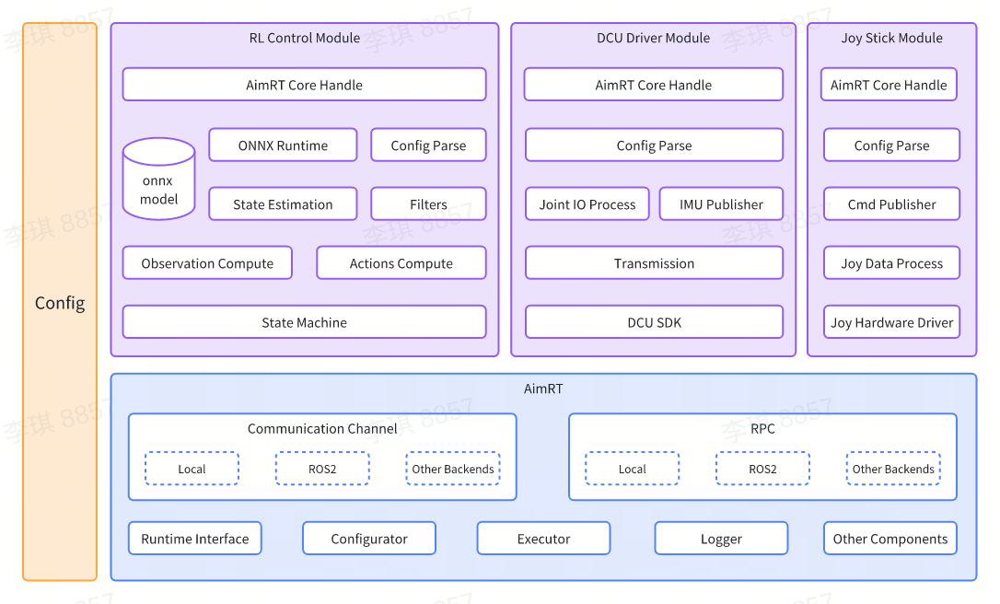

# Readme

## 简介

[智元灵犀X1](https://www.zhiyuan-robot.com/qzproduct/169.html) 是由智元研发并开源的模块化、高自由度人形机器人，X1的软件系统基于智元开源组件 `AimRT` 作为中间件实现，并且采用强化学习方法进行运动控制。

本工程为 智元灵犀X1 的配套使用软件，包含了 模型推理、平台驱动、软件仿真 等多个功能模块。

关于`AimRT`组件的详细教程可参考 [AimRT官方网站](https://aimrt.org/)。


## 软件架构图



更多模块详细注解，请见 [开发指南](doc/tutorials.zh_CN.md)。

## 目录结构

```bash
.
├── build.sh              # 编译脚本
├── cmake                 # 编译依赖的cmake脚本
│   ├── GetAimRT.cmake
│   ├── GetGTest.cmake
│   └── NamespaceTool.cmake
├── CMakeLists.txt        # 顶层 CMakeLists.txt
├── format.sh             # 格式化脚本
├── README.md             # 说明文档
├── doc                   # 开发指南目录
├── src                   # 源码目录
│   ├── CMakeLists.txt    # 源码目录的 CMakeLists.txt
│   ├── assistant         # ROS2仿真与示例工程目录
│   ├── install           # 配置脚本目录
│   ├── module            # 模块目录
│   ├── pkg               # 部署目录
│   └── protocols         # 协议目录
└── test.sh               # 测试脚本
```

## 运行方式

### 启动准备

- 安装 [GCC-13](https://www.gnu.org/software/gcc/gcc-13/)。

- 安装 [cmake](https://cmake.org/download/) 3.26 或以上版本。

- 安装 [ONNX Runtime](https://github.com/microsoft/onnxruntime) 。

```bash
sudo apt update
sudo apt install -y build-essential cmake git libprotobuf-dev protobuf-compiler

git clone --recursive https://github.com/microsoft/onnxruntime

cd onnxruntime
./build.sh --config Release --build_shared_lib --parallel

cd build/Linux/Release/
sudo make install
```

- 安装`ROS2 Humble`，并且配置好环境变量，具体可以参考 [ROS2 官网](https://docs.ros.org/en/humble/Installation/Ubuntu-Install-Debians.html)。

- 安装仿真环境依赖。

```bash
sudo apt install jstest-gtk libglfw3-dev libdart-external-lodepng-dev
```

- 若要启动实机调试，需要安装 Linux [实时内核补丁](https://wiki.linuxfoundation.org/realtime/start)。

*由于 AimRT 的依赖较多，从默认的源下载依赖会非常慢甚至失败，我们提供了基于gitee源下载的环境变量 `DOWNLOAD_FLAGS` 在 `url_gitee.bashrc` 中，只需要在运行 `build.sh` 时，先 source 一下 `url_gitee.bashrc` 然后加上gitee源环境变量的参数即可。*

准备好以上步骤后，在终端中执行以下命令：

```bash
source /opt/ros/humble/setup.bash
source url_gitee.bashrc

# 编译
./build.sh $DOWNLOAD_FLAGS

# 测试
./test.sh $DOWNLOAD_FLAGS
```

### 启动仿真

启动之前需要先插入手柄接收器

```bash
cd build/

./run_sim.sh
```

### 启动真机

首先导出当前动态库路径, **此操作只需要执行一次即可**.

```bash
# 以root权限打开 “/etc/ld.so.conf”
sudo vi /etc/ld.so.conf

# 将以下路径添加到该文件的末尾
/opt/ros/humble/lib
{你的工程绝对路径}/build/install/lib

# 刷新环境变量
sudo ldconfig
```

准备启动.

```bash
cd build/
./run.sh
```

### 手柄控制

具体控制方法请参考 [手柄控制模块](doc/joy_stick_module/joy_stick_module.zh_CN.md)。

## 许可协议

本工程提供的代码运行于 [AimRT](https://aimrt.org/) 框架之上。这是研究代码，预计会经常更改，并且不对特定用途的适用性做出任何保证。源代码根据[MULAN](https://spdx.org/licenses/MulanPSL-2.0.html)许可协议发布。

## 使用说明

如果您对该仓库有任何疑问或问题，请使用 `Issues`。

请不要通过电子邮件联系我们，因为可能无法回复。如果您想贡献代码，请简单地 fork 该仓库（或如果您是协作者，可以创建一个分支），然后进行更改并提交 pull request 给我们。
