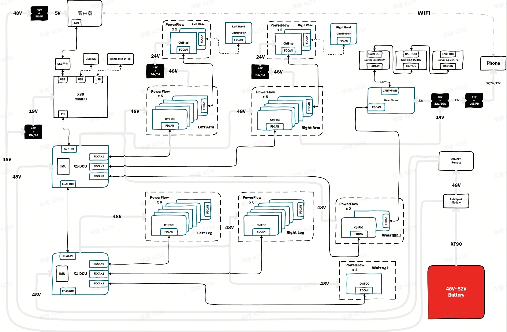
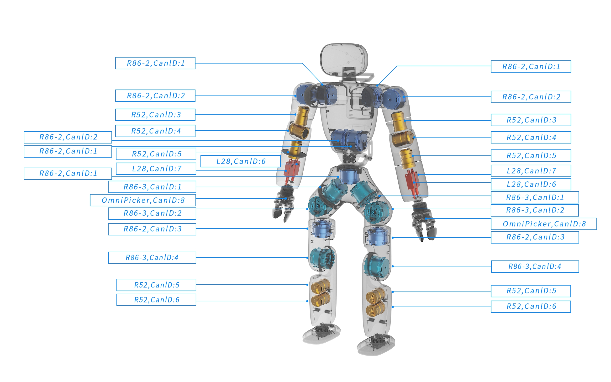
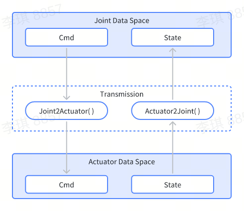

# DCU Driver Module

## Introduction

Domain Control Unit (DCU) can transmit CANFD message data via the EtherCAT bus with a refresh rate of up to 1 kHz. For more details, please refer to the [Official Introduction of DCU](https://agibotmall.com/goods_detail/5?id=5&isShowTab=false).

DCUs can be cascaded through the EtherCAT bus. Each DCU is equipped with an IMU (external) and three CANFD buses, with each bus capable of connecting up to 8 actuators in series.

To facilitate the rapid development of DCUs and actuators, we provide an SDK in the `src/module/dcu_driver_module/xyber_controller` directory. This directory is a standalone C++ software package independent of AimRT, allowing developers to extract and use it to build their projects. For an SDK example, refer to [XyberController Example](/src/module/dcu_driver_module/xyber_controller/example/main.cpp).

The DCU Driver Module further encapsulates the SDK and adapts to the AimRT software framework. We have added the transmission layer and data processing modules to the DCU Driver Module, so it can publish IMU data and provide joint control interfaces.

***Note: Since the SDK uses the EtherCAT protocol stack and enables hardware synchronization, developers need to install the PREEMPT_RT real-time kernel patch to run the SDK on the real robot.***

### Check the Real-time Kernel

- uname -a

  PREEMPT_RT appears, such as Linux Console 6.1.59-rt16 #2 SMP PREEMPT_RT Tue Feb 20 17:36:21 CST 2024 x86_64 x86_64 x86_64 GNU/Linux.

- cat /sys/kernel/realtime

  The path exists and the value is 1.

## Communication Topology

### Hardware System Architecture

As shown in the diagram below, the X86 main controller connects to the upper limb DCU and lower limb DCU through the EtherCAT bus. Each DCU is labeled with 3 FDCAN buses, corresponding to CTRL-1, CTRL-2, and CTRL-3 on the DCU casing. The system diagram clearly shows the communication topology of the joints.

As shown, the CTRL-1 channel of the upper limb DCU connects to 8 joints of the left arm, including 5 rotary joints, 2 push rods, and 1 gripper. The CTRL-3 channel connects to two parallel joints in the waist and upper limb.



### Joint ID Assignment

Assign all joint IDs in the order shown in the diagram below. For the complete set, the ID labels are attached to the actuators by default. Please check them carefully.



## Module Inputs and Outputs

To facilitate debugging with ROS2, some data types are natively supported by ROS2.

| Topic                | Description                                         | Data Type                            |
| -------------------- | --------------------------------------------------- | ------------------------------------ |
| /joint_cmd           | Input for downstream joint control                  | my_ros2_proto::msg::JointCommand     |
| /joint_states        | Output for upstream joint data                      | sensor_msgs::msg::JointState         |
| /imu/data            | Output for upstream IMU data from the lower limbs   | sensor_msgs::msg::Imu                |

### About /joint_cmd

```bash
std_msgs/Header header

string[] name
float64[] position
float64[] velocity
float64[] effort
float64[] stiffness
float64[] damping
```

/joint_cmd uses joint names as indices and employs a data type specifically for `hybrid force/position control`. All rotary joints support this control type.

***Note: For gripper joints, only the fields "position" and "effort" are valid, while other fields must be 0.***

- for /joint_cmd: "position" is in `percentages`, ranging from 0 to 1.0, where 0 represents "fully gripped"; "effort" indicates the percentage of maximum current, ranging from 0 to 1, with the maximum value configured in the gripper.

- for /joint_states: The meanings of "position" and "effort" remain unchanged. "velocity" is the percentage of maximum speed, with a numerical range of 0-1.0.

## Parameter Configuration

The parameters of the DCU Driver Module are described in the field `DCUDriverModule` of the [Configuration File](/src/install/linux/bin/cfg/x1_cfg.yaml) with detailed comments.

Developers need to correctly configure the `dcu_network` field according to the actual joint connections of the robot.

## About the Transmission Layer



In the program, downstream and upstream data are transmitted through the joint space and actuator space.

Upon the reception of downstream data, the module will cache it into the joint space by the joint name. After conversion in the transmission layer, the module will cache the data into the corresponding actuator space, and then distribute it via the SDK. The same process applies to upstream data.

Joints and actuators are bound through the transmission layer, and the detailed binding relationships are specified in the `transmission` field of the configuration file.
