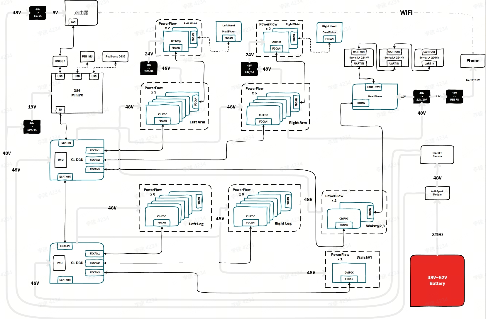
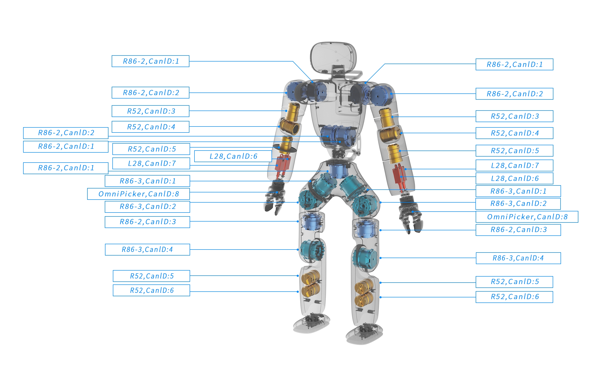

# DCU Driver Module

## 模块简介

域控制器（ Domain Control Unite ） 简称 DCU，可通过 EtherCAT 总线吞吐 CANFD 报文数据，刷新频率可达 1Khz。详情参见 [DCU官方介绍](https://agibotmall.com/goods_detail/5?id=5&isShowTab=false)。

DCU 可通过 EtherCAT 总线进行级联，每一个DCU拥有一个IMU设备（外挂）以及三条CANFD总线，每条总线最多可以串联8个执行器。

为方便对 DCU 和执行器进行快速开发，我们提供了一套 SDK，位于 `src/module/dcu_driver_module/xyber_controller` 目录下，该目录是一个独立的C++软件包，不依赖于 AimRT，开发者可将其提出用于构建自己的工程项目。SDK示例可参见 [XyberController Example](/src/module/dcu_driver_module/xyber_controller/example/main.cpp)。

DCU Driver Module 是对 SDK 的进一步封装，并且适配了AimRT的软件框架，增加了传动层、数据处理等模块，可发布IMU数据以及提供关节控制接口。

***请注意：由于SDK内部用到了EtherCAT协议栈且开启了硬件同步，运行实机时需要安装 PREEMPT_RT 实时内核补丁。***

### 实时内核查看方法

- uname -a

  出现 PREEMPT_RT 字样，例如 Linux Console 6.1.59-rt16 #2 SMP PREEMPT_RT Tue Feb 20 17:36:21 CST 2024 x86_64 x86_64 x86_64 GNU/Linux

- cat /sys/kernel/realtime

  路径存在且值为1

## 通信拓扑

### 硬件系统架构

下图中，X86主控通过 EtherCAT 总线先后连接了上肢DCU和下肢DCU，每一路DCU上面标注有3路 FDCAN，分别对应DCU外壳上面标注的 CTRL-1、CTRL-2、CTRL-3。根据系统图示可以轻松找出关节的通信拓扑。

例如，由图中可见，上肢DCU的 CTRL-1 通道连接了左臂8个关节，分别是5个旋转和2个推杆以及1个夹爪; CTRL-3 通道连接了腰部上肢的两个并联关节。



### 关节ID分配

所有关节的ID配置需要按照下图中的顺序来分配，整机套装中默认会在执行器上面贴好ID标签，请注意检查。



## 模块输入与输出

为方便用户使用ROS2进行调试，我们将部分数据类型选为ROS2原生支持的类型。

| 话题                  | 含义                      | 数据类型                                                   |
| -------------------- | ------------------------- | -------------------------------------------------------- |
| /joint_cmd           | 输入，关节下行控制           | my_ros2_proto::msg::JointCommand                         |
| /joint_states        | 输出，关节上行数据           | sensor_msgs::msg::JointState                             |
| /imu/data            | 输出，下肢IMU上行数据        | sensor_msgs::msg::Imu                                    |

### 关于 /joint_cmd

```bash
std_msgs/Header header

string[] name
float64[] position
float64[] velocity
float64[] effort
float64[] stiffness
float64[] damping
```

/joint_cmd 使用关节名称作为索引，其数据类型为`力位混合控制`专用，所有的旋转关节都支持此种控制类型。

***请注意：对于夹爪关节，只有 position 和 effort 字段生效，其他字段需要保持为0。***

- 下行控制：position 单位为`百分比`，数值范围 0 - 1.0，0代表完全夹紧；effort 代表最大电流的百分比，数值范围 0 - 1，最大值于夹爪中配置。

- 上行状态：position 和 effort 意义保持不变。velocity 为最大速度的`百分比`，数值范围 0 - 1.0。

## 参数配置

DCU Driver Module 的参数在 [配置文件](/src/install/linux/bin/cfg/x1_cfg.yaml) 中的 `DCUDriverModule`字段中，并且配有详细的注释说明。

开发者需要根据机器实际的关节连接情况，正确的配置 `dcu_network` 字段。

## 关于传动层


程序中将上下行数据划分为 关节空间 和 执行器空间。

模块收到下行数据后，会根据关节名称将数据缓存至关节空间，经过传动转换后缓存至对应的执行器空间，再经由SDK下发。上行同理。

关节与执行器通过传动层进行绑定，详细的绑定关系由配置文件中的 `transmission` 字段指定。