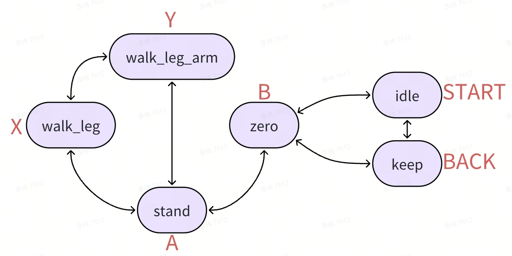

# Joy Stick Module

## About the Joystick

[Logitech F710](https://www.logitechg.com/zh-cn/products/gamepads/f710-wireless-gamepad.940-000172.html?sp=1&searchclick=logi) joystick is used in the project.

## Joystick Settings

To view the joystick mapping settings, please refer to [jstest-gtk](https://github.com/Grumbel/jstest-gtk).

```bash
jstest-gtk
```

The default mapping is usually shown in the following figure, with red characters corresponding to the joystick buttons.

Press the RB key to wave your hand while in keep, stand, or walk_1eg states. In all states, you can press the START button to directly switch to the idle state.

Note: During simulation, first switch the robot to ZERO state, then click reset to make the robot stand, and then switch to walking mode.



Status description:

-Idle state, no torque output from the joint

-Keep: Maintain the state, keep the joint in its current position

-Zero: Return to zero state, the joint returns to zero position

-Stand: In a standing position, the joints return to the standing position

-Walk_leg: Walking state, keeping the upper body still. At this point, hold down LB and push the left joystick to control the robot's walking, and push the right joystick to control the robot's turning

-Walk_leg_arm: Walking state, shoulder pitch follows the walking. At this point, hold down LB and push the left joystick to control the robot's walking, and push the right joystick to control the robot's turning

**Note: Due to the iterative update of the model, please use the walk_1eg_arm mode when controlling the movement of the real machine. Both modes can be used during simulation.**

