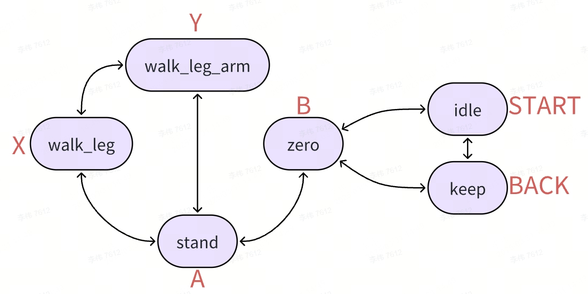

# Joy Stick Module

## 关于手柄

工程中使用手柄型号为 [罗技 F710](https://www.logitechg.com/zh-cn/products/gamepads/f710-wireless-gamepad.940-000172.html?sp=1&searchclick=logi)。

## 手柄设置

查看手柄映射设置 [jstest-gtk](https://github.com/Grumbel/jstest-gtk)

```bash
jstest-gtk
```

默认映射通常如下图，红色字符对应手柄按键。

在 keep、stand、walk_leg状态下，按RB键可以挥手。所有状态下，都可以按START键直接切到idle状态。

注：仿真时，先将机器人切换至ZERO状态，然后点击 reset 让机器人站立，再切换至行走模式。



状态说明：

- idle：空闲状态，关节没有力矩输出

- keep：保持状态，关节保持当前位置

- zero：归零状态，关节回到零位

- stand：站立状态，关节回到站立位置

- walk_leg：行走状态，上半身保持不动。此时按住LB，推动左摇杆可以控制机器人行走，推动右摇杆可以控制机器人转弯

- walk_leg_arm：行走状态，肩部pitch跟随行走。此时按住LB，推动左摇杆可以控制机器人行走，推动右摇杆可以控制机器人转弯

**注：由于模型迭代更新，控制真机行走时请使用 walk_leg_arm 模式，仿真时二者皆可。**

