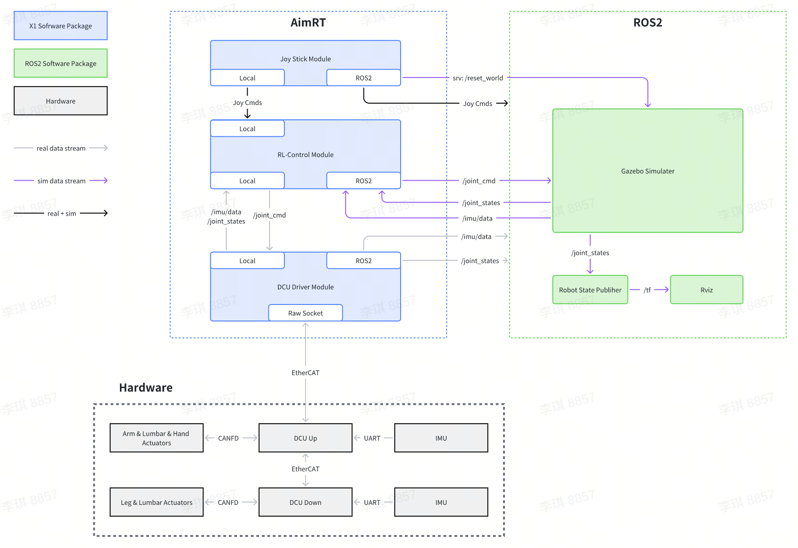

# Tutorials

## Module Data Flow



## Parameter Configuration

The [configuration file](/src/install/linux/bin/cfg/x1_cfg.yaml) contains all the parameter configurations for AimRT and three modules.
For details, please refer to the [AimRT Configuration Guide](https://docs.aimrt.org/tutorials/index.html#id3) as well as the detailed descriptions of each module.

## Module Descriptions

- [Inference & Simulation - RL Control Module](rl_control_module/rl_control_module.md)

- [DCU Joint Driver - DCU Driver Module](dcu_driver_module/dcu_driver_module.md)

- [Joystick Control Driver - Joy Stick Module](joy_stick_module/joy_stick_module.md)

## Communicate with Native ROS2

Communication with native ROS2 nodes is enabled by mounting ROS2-backend Channels/RPCs. Examples of the native ROS2 publisher and client are provided in the assistant directory. After launching the AimRT process, developers can observe communication between the publisher and client by starting an example process of a native ROS2 publisher or client.

Please note that before launching the AimRT process or the example processes of a native ROS2 publisher or client, please source the ROS2 protocol in the current command-line window:

```bash
source ./install/ros2_setup.sh
```

For details on the configuration and usage of ROS2 plugins, refer to [ROS2 Plugins](https://docs.aimrt.org/tutorials/plugins/ros2_plugin.html).

For more information on RPC configuration, refer to [RPC Configuration](https://docs.aimrt.org/tutorials/plugins/grpc_plugin.html). For RPC interfaces, refer to [RPC Interface](https://docs.aimrt.org/tutorials/interface_cpp/rpc.html).

For more information on Channel configuration, refer to [Channel Configuration](https://docs.aimrt.org/tutorials/cfg/channel.html). For Channel interfaces, refer to [Channel Interface](https://docs.aimrt.org/tutorials/interface_cpp/channel.html).

Both Channel and RPC support multiple backends. For single-process scenarios, we have optimized AimRT's `Local RPC Backend` to automatically determine whether the client and server are within the same package. If they are, Local RPC Backend will directly call functions within that package. The same applies to the `Local Channel Backend`; In principle, use the Local backend for all intra-process communications. For external communications, the ROS2 backend is recommended.
