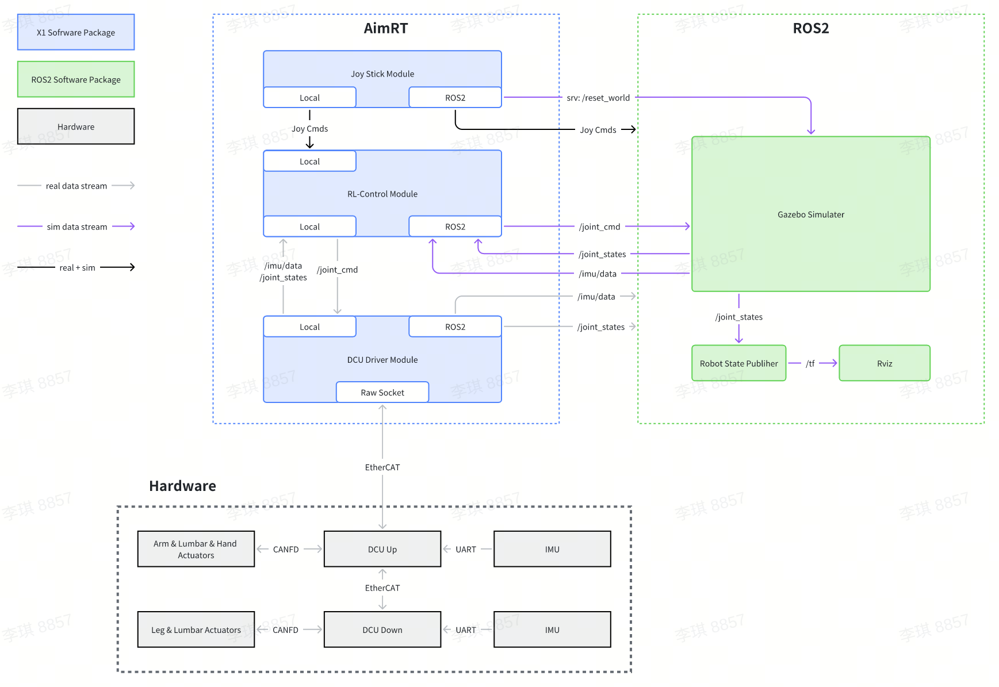

# Tutorials

## 模块数据流



## 参数配置

在 [配置文件](/src/install/linux/bin/cfg/x1_cfg.yaml) 中,包含了 AimRT 以及三个模块的全部参数配置。
详细信息请参考 [AimRT配置说明](https://docs.aimrt.org/tutorials/index.html#id3) 以及各模块的详细说明。

## 模块说明

- [推理与仿真 - RL Control Module](rl_control_module/rl_control_module.zh_CN.md)

- [DCU关节驱动 - DCU Driver Module](dcu_driver_module/dcu_driver_module.zh_CN.md)

- [手柄控制驱动 - Joy Stick Module](joy_stick_module/joy_stick_module.zh_CN.md)

## 与原生 ROS2 通信

挂载了ROS2后端的 Channel / RPC 即可与原生 ROS2 节点通信，在 assistant 目录下提供了原生 ROS2 的 publisher 和 client 的示例，启动 aimrt 进程后，再启动原生原生 ROS2 的 publisher 或 client 的示例进程即可观察到两者间的通信。

注意，在启动 aimrt 进程或原生 ROS2 的 publisher 或 client 的示例进程前，需要在当前命令行窗口内 source ROS2 的协议：

```bash
source ./install/ros2_setup.sh
```

ROS2 插件的配置以及使用可以参考 [ROS2 插件](https://docs.aimrt.org/tutorials/plugins/ros2_plugin.html)。

有关 RPC 的更多配置，可以参考 [RPC 配置](https://docs.aimrt.org/tutorials/plugins/grpc_plugin.html)，RPC 的接口可以参考 [RPC 接口](https://docs.aimrt.org/tutorials/interface_cpp/rpc.html)。

关于更多 Channel 的配置，可以参考 [Channel 配置](https://docs.aimrt.org/tutorials/cfg/channel.html)，Channel 的接口可以参考 [Channel 接口](https://docs.aimrt.org/tutorials/interface_cpp/channel.html)。

无论是 Channel 还是 RPC，都支持多个后端。针对单进程场景，AimRT 的`Local RPC 后端`对其做了优化，会自动判断 Client 端和 Server 端是否在同一个 Pkg 内，如果是，则直接调用 Pkg 内的函数。`Local Channel 后端`也一样，理论上所有进程内通信都应该使用 Local 后端。针对于对外的通信，推荐使用 ROS2 后端。
